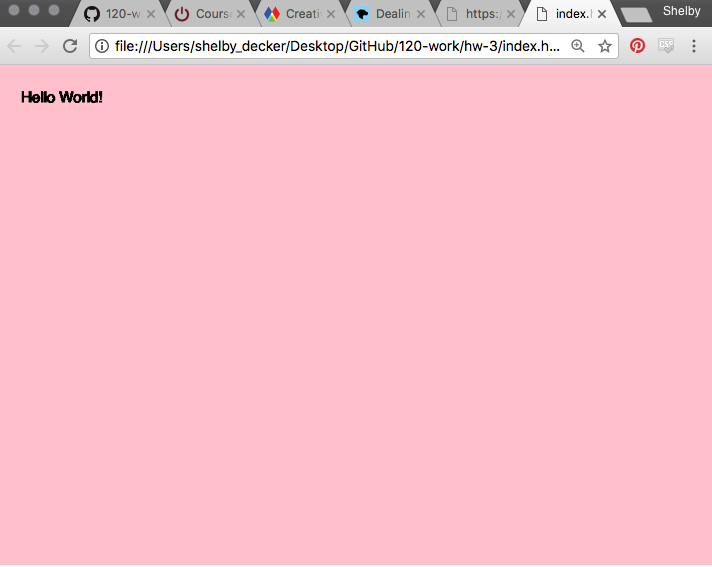

Shelby Decker , 50
##### Date: Feb 5, 2018
# ["Hello World!" Sketch](https://sndher.github.io/120-work/hw-3/)
### HW-3 Response
## Intro
More Progress! I made much more success this week than I did last week.

I felt so much more capable of understanding what was happening with the coding.

## Experiments
This week I really liked working with changing the colors of of the canvas. My favorite greyscale was between (85 and 210).

### Image of markup

