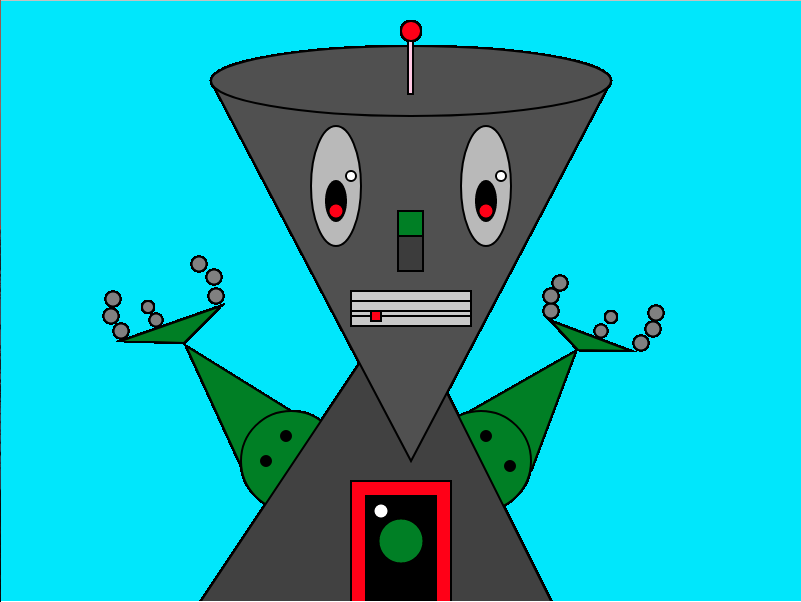

##### Shelby Decker
February 13, 2018
# Week 4 Homework Summary

### Robot Sketch
For this week, I was **very** excited to create some artwork. I had high expectations and hoped to get complex quickly. However, I did not realize how much work goes into a * slightly * detailed sketch.

## Steps

I utilized the P5 Reference pages at <a>p5js.org/reference/</a> and the Creative Coding 120 course website https://montana-media-arts.github.io/creative-coding-1/modules/week-4/homework-example/. These resources greatly helped me to stay focused and helped me to address any problems.

###### Issue
While working on the assignment this week, I was having a difficult time with sorting out my sketch pieces into the right layer order. I also occasionally ran into the problem where my sketch would disappear if I had forgot a semicolon.

###### Solution
I reviewed the processes of the order of operations and was able to put my pieces in the right order and then design them by category, naming the elements as I created them. This helped me to get the main concept structure, then build the detail on top of that.


## Homework Assignments
1. sketch.js (self-portrait/robot)
2. readme.md

### Light Blue Canvas
```JS  
// create a canvas
  createCanvas( 800, 600 );
  // color the background 'light blue' (30, 230, 255)
  background(30, 230, 255);
```
I had a hard time finding the correct color code combination that I wanted to use for this background. I wanted to find a light blue color that was still bright and vibrant.

I solved this by opening up Adobe Photoshop CC and picking out a color I desired on the selection pallet. In the panel, I could then see that the color recipe was R:30 G:230 B:255.

## Aspirations
I want to become more skilled at mapping points on the grid so I can more work quickly and accurately to code shapes and lines. I also want to experiment more with different types of functions so that I can be more familiar and learn more about what I can do with P5.js.

### Image of markup

