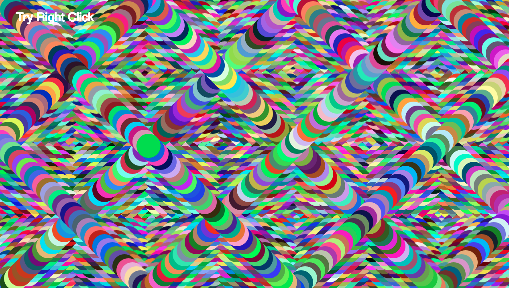
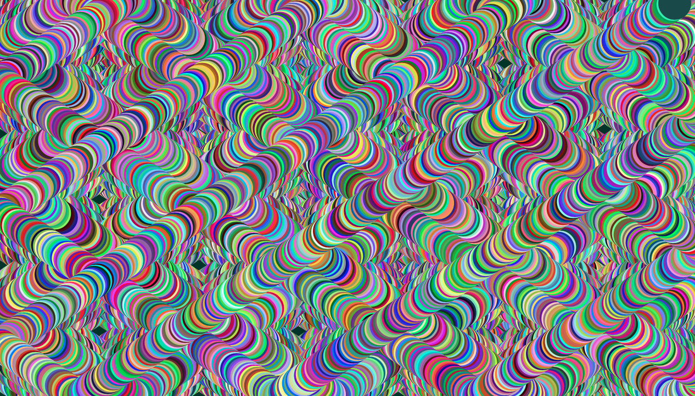
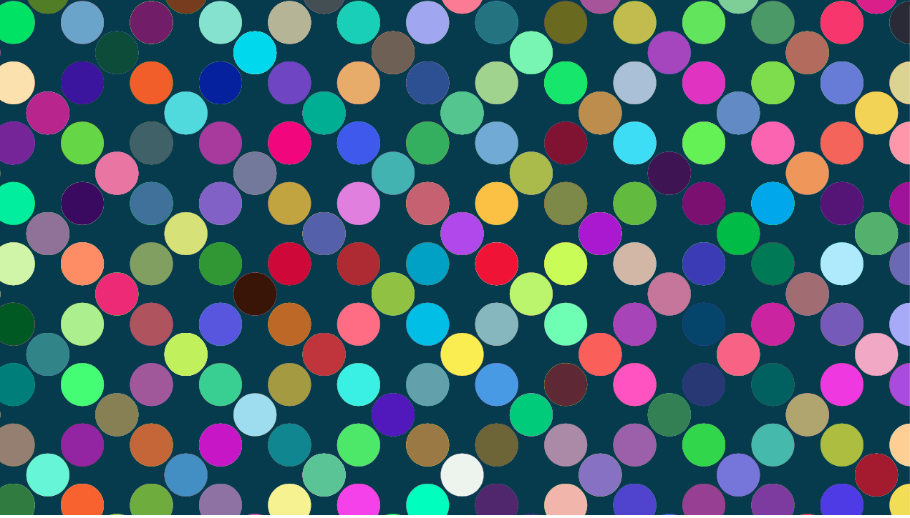
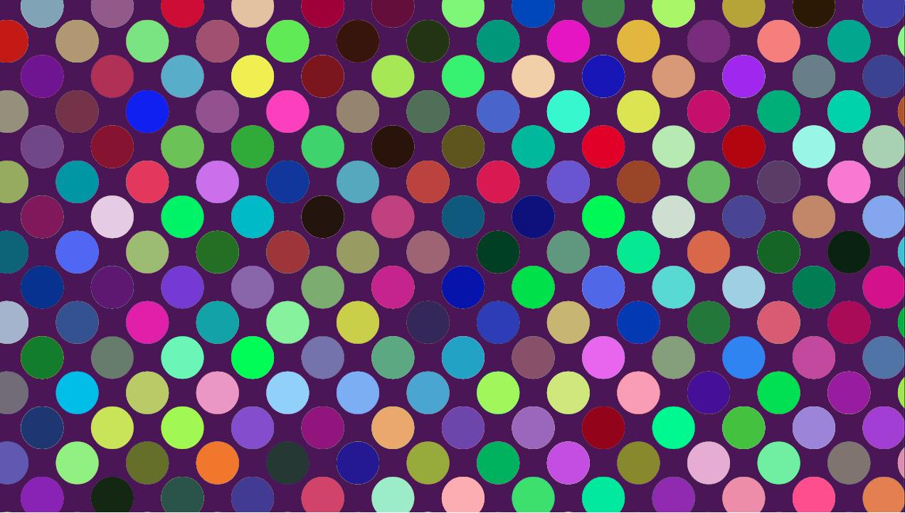

Shelby Decker, Coding Section: 50

[Live Sketch Link](https://sndher.github.io/120-work/hw-7/)

# HW 7 | Bouncing Ball

## Description of What the Original Code is Doing

<!--
--This is a Comment Block--

Please describe what the original code is doing.

Why is it working the way it is?
What does each line do?
How can you make the ball change direction?

-->
 For the first section of the code, **ball.width**  changes the size of the ball to be (x amount of pixels wide).

**ball.x** and **ball.y** determine the starting location of ball animation on canvas position (x,y).

**ball.delta_x** and **ball.delta_y** determine at which angle the ball moves from starting from original position.

**ball.scale_x** and **ball.scale_y** control the speed of starting ball on the (x and y axis and minor control of position angle of movement).

**ball.x += ball.delta_x * ball.scale_x** and **ball.y += ball.delta_y * ball.scale_y** allow the ball drawn to move along the x and y axis and sets the ball in motion using the constraints in the setup function.

**if (ball.x >= width || ball.x <= 1)** and **if (ball.y >= height || ball.y <= 1)** set animation boundary rules, and keeps the ball within the canvas.

**ball.delta_x = -1 * ball.delta_x** and **ball.delta_y = -1 * ball.delta_y** allows ball animation to (bounce) off the top and bottom edges of the canvas.

**ellipse(ball.x, ball.y, ball.width, ball.width)** draws the ball using the size constraints previously determined within the setup function.

## How did you alter the sketch?

<!--
Please describe how and why you changed the sketch?
-->
I started  by changing the origin of the balls x and y axis to start toward the middle of the canvas. I changed the size of the ball to be larger and changed the original x and y axis movement so that the ball would move quicker through out the sketch animation. I did keep the balls original angle to be the same, as a 1x to 1y downward movement.

I then added the background color to change after first time the mouse is pressed. I set the color change to be a random value between 0 and 255 for each of the RGB place values for each time mouse is pressed. I then changed the animation of the ball to have a no stroke setting. For the ball, I tried one color value of green, but then I decided that it was more interesting to set the circle to have a random color value as well each time the ball is sketched.

#### Images

