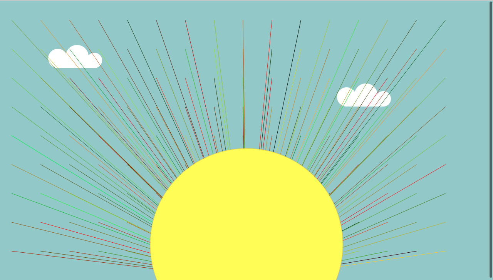

Shelby Decker, Coding Section: 50

[Live Sketch Link](https://sndher.github.io/120-work/hw-8/)

# HW 8 | Loops & For Loops

## Sun Sketch

I started out with the sun beams, and line loops. I wanted all the points to meet at the bottom and center of the page. I then changed the color to be a stroke(random(255), random(255), random(0)); to give the range of color anywhere from a red to a green so that I would also get flickers of yellow and orange color.

I wanted to make the stroke of the lines thicker but I was not successful on doing this. I tried using stroke(10); to see how this would effect the lines in the For Loop but no result.

The sun ellipse was pretty straight forward, I wanted it to live along the y axis in the middle of the window so that it stays in alignment with the rays and be able to move up and down with interaction.

## Clouds
I created a sandbox using the push(); and pop(); functions. This made it much easier for me to place the cloud as a whole where I wanted it to be and also to copy the entire sandbox to duplicate the shape.

I wanted to size of the cloud on the right hand side to be larger than the original, but I could not effectively use the scale(); function. Not sure why, but I will look into this for future sketches.

#### Image

